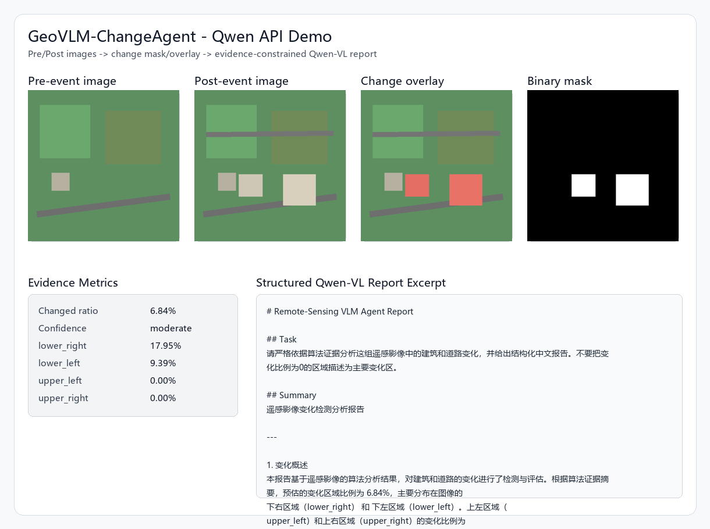
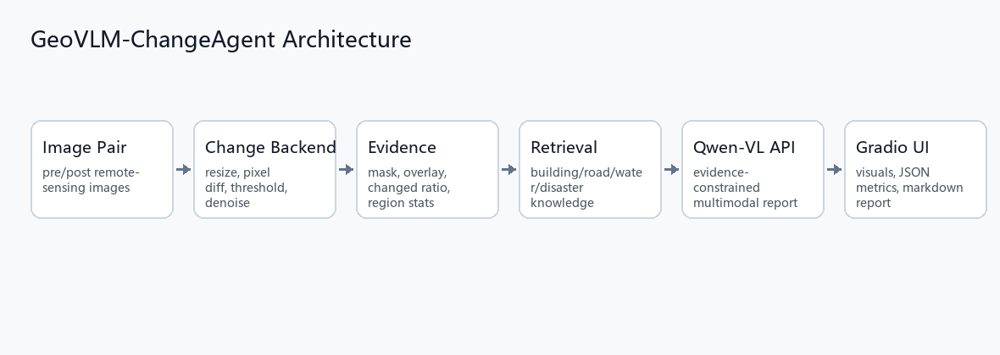
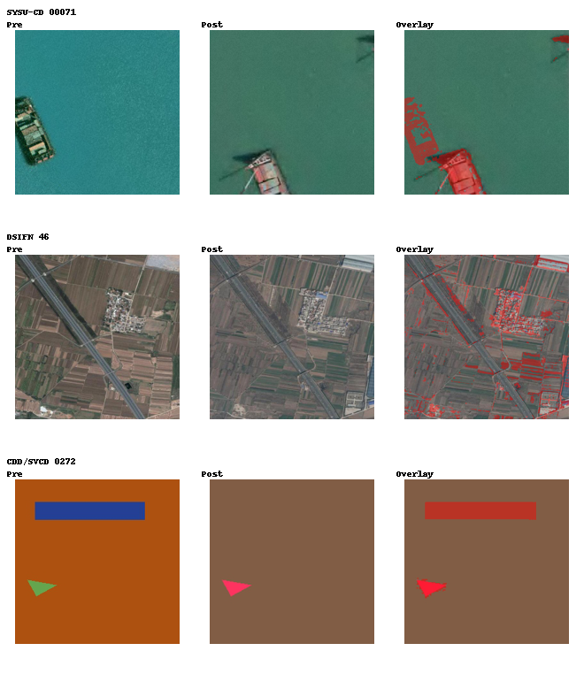

# GeoVLM-ChangeAgent

GeoVLM-ChangeAgent is a multimodal remote-sensing change interpretation system.
It combines local image-change evidence extraction, domain knowledge retrieval,
Qwen-VL API reasoning, and a Gradio web demo to generate structured Chinese
interpretation reports from pre-event and post-event remote-sensing image pairs.

This is not a self-trained foundation model. It is an engineering prototype that
shows how to connect computer vision, visual evidence, RAG-style domain context,
and a multimodal large model into an end-to-end application.

## Demo Result

The current demo produces:

- `change_mask.png`: binary candidate change mask.
- `change_overlay.png`: red overlay on the post-event image.
- `report.md`: structured interpretation report.
- Gradio UI: image upload, model-mode selection, visual evidence, JSON metrics,
  and report display.

Example output:

```text
Changed ratio: 6.84%
Confidence: moderate
lower_right: 17.95%
lower_left: 9.39%
upper_left: 0.00%
upper_right: 0.00%
```

Validated API demo report:

```text
outputs/api_demo_v3/report.md
```

### Qwen API Demo



### Architecture



## Real Cases

In addition to the synthetic stable demo pair, the repository includes three
real remote-sensing change-detection examples selected from local datasets:

- `real_cases/case_001_sysu_cd_00071`
- `real_cases/case_002_dsifn_46`
- `real_cases/case_003_cdd_svcd_0272`

Run all real cases:

```bash
python scripts/run_real_cases.py
```

Outputs are written to:

```text
outputs/real_cases/
```

Real-case overview:



Baseline results:

| Case | Source | Changed ratio | Confidence |
| --- | --- | ---: | --- |
| `case_001_sysu_cd_00071` | SYSU-CD | 9.38% | high_change_detected |
| `case_002_dsifn_46` | DSIFN-Dataset | 12.10% | high_change_detected |
| `case_003_cdd_svcd_0272` | CDD/SVCD | 8.24% | high_change_detected |

## Technical Stack

- Python
- Numpy / Pillow
- Gradio
- Qwen-VL API through DashScope/OpenAI-compatible API
- Lightweight RAG-style retrieval
- Markdown report generation
- WSL Ubuntu runtime
- Docker-ready project structure

## System Pipeline

```text
Pre-event image + post-event image + user instruction
        |
        v
Image preprocessing and size alignment
        |
        v
Pixel-level difference + threshold segmentation
        |
        v
Noise filtering + binary change mask
        |
        v
Change overlay + regional evidence statistics
        |
        v
Domain knowledge retrieval
        |
        v
Qwen-VL / heuristic report generation
        |
        v
Structured JSON + markdown report + Gradio visualization
```

## Core Modules

```text
src/rs_vlm_agent/change_detection.py
```

Implements image loading, resizing, pixel difference, thresholding, noise
filtering, change-ratio calculation, region statistics, mask export, and overlay
generation.

```text
src/rs_vlm_agent/retrieval.py
```

Provides a lightweight remote-sensing knowledge base for building, road,
water-body, and disaster interpretation risks.

```text
src/rs_vlm_agent/vlm_api.py
```

Calls an OpenAI-compatible multimodal API. The default configuration supports
DashScope/Qwen-VL through `DASHSCOPE_API_KEY` and `VLM_API_MODEL`.

```text
src/rs_vlm_agent/pipeline.py
```

Orchestrates the full visual-agent workflow.

```text
app.py
```

Provides the Gradio web demo.

## Quick Start

### 1. Activate WSL Environment

```bash
source ~/miniconda3/etc/profile.d/conda.sh
conda activate rscd
cd remote_sensing_vlm_agent
```

### 2. Choose A Mode

This project has two practical modes.

| Mode | Requires API key | What it does | Recommended for |
| --- | --- | --- | --- |
| `heuristic` | No | Runs local change detection, mask/overlay generation, evidence metrics, and a local rule-based report. | Anyone cloning the repo, quick demo, GitHub reviewers |
| `qwen_api` | Yes | Runs local change detection and sends overlay + evidence + retrieval context to Qwen-VL for a structured Chinese report. | Private demo, multimodal model showcase |

If you do not have a valid DashScope API key, use `heuristic`.

### 3. Create Demo Images

```bash
python scripts/create_demo_data.py
```

### 4. Run Local Heuristic Mode

```bash
python cli.py \
  --pre demo_data/pre.png \
  --post demo_data/post.png \
  --instruction "分析建筑和道路变化" \
  --model-mode heuristic \
  --output-dir outputs/demo
```

### 5. Run Qwen-VL API Mode

Do not commit API keys to GitHub.

```bash
export DASHSCOPE_API_KEY="your_api_key"
export VLM_API_MODEL="qwen-vl-plus"

python cli.py \
  --pre demo_data/pre.png \
  --post demo_data/post.png \
  --instruction "请严格依据算法证据分析这组遥感影像中的建筑和道路变化，并给出结构化中文报告。不要把变化比例为0的区域描述为主要变化区。" \
  --model-mode qwen_api \
  --output-dir outputs/api_demo
```

### 6. Run Web Demo Without API Key

This is the safest mode for public GitHub users.

```bash
export GRADIO_ANALYTICS_ENABLED=False
python app.py
```

Open:

```text
http://127.0.0.1:7860
```

In the UI:

1. Select a demo example.
2. Choose `Model mode = heuristic`.
3. Click `Analyze`.
4. View the mask, overlay, evidence metrics, and local report.

### 7. Run Web Demo With Qwen-VL API

```bash
export DASHSCOPE_API_KEY="your_api_key"
export VLM_API_MODEL="qwen-vl-plus"
export GRADIO_ANALYTICS_ENABLED=False

python app.py
```

Open:

```text
http://127.0.0.1:7860
```

In the UI:

1. Select a demo example.
2. Choose `Model mode = qwen_api`.
3. Click `Analyze`.
4. View the Qwen-VL generated structured Chinese report.

If the key is missing, expired, or out of quota, the page still works in
`heuristic` mode. `qwen_api` will show an API error in the report.

## Docker

CPU demo deployment:

```bash
docker build -t geovlm-changeagent .
docker run --rm -p 7860:7860 geovlm-changeagent
```

For API mode in Docker:

```bash
docker run --rm -p 7860:7860 \
  -e DASHSCOPE_API_KEY="your_api_key" \
  -e VLM_API_MODEL="qwen-vl-plus" \
  geovlm-changeagent
```

## What This Project Demonstrates

- Ability to build an end-to-end AI application rather than only call a chatbot
  API.
- Computer-vision preprocessing and visual evidence extraction.
- Multimodal model integration with Qwen-VL.
- RAG-style domain context injection.
- Prompt constraints that force the VLM to respect algorithmic evidence.
- Web demo deployment with Gradio.
- Clear upgrade path toward stronger remote-sensing models.

## API Key Policy

Never commit a real API key. Keep only `.env.example`.

For public GitHub usage:

```bash
python app.py
```

Then use:

```text
Model mode = heuristic
```

For private Qwen-VL demo usage:

```bash
export DASHSCOPE_API_KEY="your_api_key"
export VLM_API_MODEL="qwen-vl-plus"
python app.py
```

Then use:

```text
Model mode = qwen_api
```

## Limitations

- The current change detector is a lightweight baseline based on pixel
  difference. It expects the two images to show the same region with similar
  scale and alignment.
- It is not yet a production-grade remote-sensing change-detection model.
- The Qwen-VL report depends on API availability and model pricing.
- The demo uses synthetic images for stable presentation. Real remote-sensing
  images should be aligned, resized, and preferably radiometrically normalized.

## Upgrade Roadmap

1. Add real remote-sensing image pairs.
2. Add automatic image registration and normalization.
3. Replace the baseline detector with BIT, ChangeFormer, SAM/SAM2-assisted
   proposals, or GeoChangeMamba.
4. Add batch evaluation on a small change-detection dataset.
5. Add model comparison: heuristic mode vs Qwen-VL API vs local VLM.
6. Add LoRA fine-tuning experiments through the companion
   `vlm_finetune_benchmark` project.

## Project Summary

One-sentence version:

```text
GeoVLM-ChangeAgent extracts visual change evidence from pre/post images,
retrieves domain knowledge, and uses Qwen-VL to generate structured Chinese
reports through a Gradio web demo.
```

More detailed version:

```text
The project is organized as a visual-agent pipeline. First, a local image
processing module aligns the two images, computes a change mask, filters noise,
and calculates regional change statistics. Then a retrieval module injects
remote-sensing interpretation knowledge. Finally, the system sends the overlay
image, algorithm evidence, and user instruction to Qwen-VL through an
OpenAI-compatible API, producing a structured report. The Gradio UI provides
interactive display, and the backend keeps adapter interfaces for future SAM,
ChangeFormer, GeoChangeMamba, or local VLM integration.
```
